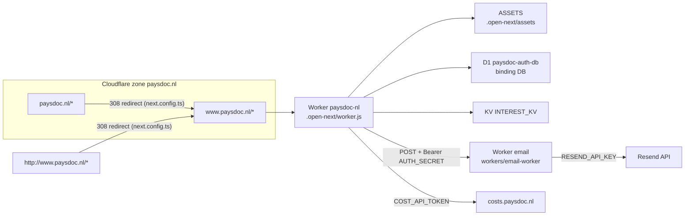

# Deployment Runbook

How paysdoc.nl is built, deployed, operated and debugged on Cloudflare Workers. Written to be executed top to
bottom by the owner or by an agent that has never seen the project: every step names the exact command and where
its output lands. Local `wrangler` is **not** logged in on the development machine, so every Cloudflare operation
goes through GitHub Actions using the repository's Cloudflare secrets.

> [!NOTE]
> **Status on 2026-09-16.** The site is live on the Worker: `https://www.paysdoc.nl/` answers 200, the apex and
> plain-http requests 308 to it, and the automated production smoke test passes 35/35
> ([[Production-Smoke-Test]]). The one-off steps that got it there are recorded in section 4 for reference; the
> only items still with the owner are the OAuth redirect-URI confirmation
> ([#35](https://github.com/paysdoc/paysdoc.nl/issues/35)), the human part of
> [[Manual-Verification-Checklist]] and the cleanup in section 6
> ([#37](https://github.com/paysdoc/paysdoc.nl/issues/37)).

## 1. Architecture



| Piece | Name / value | Defined in | Notes |
| --- | --- | --- | --- |
| Site Worker | `paysdoc-nl`, entry `.open-next/worker.js` | `wrangler.jsonc` (`main`) | Built by `@opennextjs/cloudflare` from the Next.js 16 app (`open-next.config.ts`) |
| Static assets | `.open-next/assets`, binding `ASSETS` | `wrangler.jsonc` (`assets`) | Shipped by the same `wrangler deploy`; there is no separate Pages upload |
| Self reference | service binding `WORKER_SELF_REFERENCE` → `paysdoc-nl` | `wrangler.jsonc` (`services`) | Required by OpenNext for internal fetches |
| Database | D1 `paysdoc-auth-db`, id `138b4abc-dc32-4f08-98a7-87442977a5d3`, binding `DB` | `wrangler.jsonc` (`d1_databases`) | Auth.js tables (`migrations/0001`), dashboard tables (`0002`), cost tables (`0003`). Code always reads `env.DB` |
| Interest form store | KV `INTEREST_KV`, id `eefd36f984b64b4eb95f368a86867aaa`, binding `INTEREST_KV` | `wrangler.jsonc` (`kv_namespaces`) | `POST /api/interest` writes one key per email (`{email, timestamp}`); list with `operation=kv-keys` |
| Email Worker | `email`, entry `workers/email-worker/src/index.ts` | `workers/email-worker/wrangler.jsonc` | Sends Auth.js magic-link mail through Resend; `EMAIL_FROM=noreply@paysdoc.nl` as a var |
| Site → email link | var `EMAIL_WORKER_URL=https://email.paysdoc.workers.dev` | `wrangler.jsonc` (`vars`) | `src/auth.ts` POSTs `{to, url}` with `Authorization: Bearer <AUTH_SECRET>` |
| Cost API | var `COST_API_URL=https://costs.paysdoc.nl` + secret `COST_API_TOKEN` | `wrangler.jsonc` (`vars`) | Declared as bindings; the app does not call it yet |
| Routes | `www.paysdoc.nl/*` and `paysdoc.nl/*`, zone `paysdoc.nl` | `wrangler.jsonc` (`routes`) | Created by `wrangler deploy`; a zone route intercepts requests before the old Pages project, so DNS is untouched. With routes set and `workers_dev` unset, `paysdoc-nl.paysdoc.workers.dev` is disabled (404) |
| Apex redirect | host `paysdoc.nl` → `https://www.paysdoc.nl/…`, permanent (308) | `next.config.ts` `redirects()` | `www` is canonical; `metadataBase` in `src/app/layout.tsx` matches. Host matched with an anchored regex `^paysdoc\.nl$` and split into `/` + `/:path+` rules because of OpenNext quirks (see the file comment) |
| HTTP → HTTPS | `x-forwarded-proto: http` → `https://www.paysdoc.nl/…`, permanent (308) | `next.config.ts` `redirects()` | The zone's *Always Use HTTPS* is off, so the Worker upgrades plain-http itself |
| Security headers | `Strict-Transport-Security: max-age=31536000`, `X-Content-Type-Options: nosniff`, `Referrer-Policy: strict-origin-when-cross-origin` on every rendered page | `next.config.ts` `headers()` | Not on static assets (served by `ASSETS` before the Worker runs) nor on middleware/redirect responses. No `includeSubDomains`/`preload` on purpose |
| Runtime flags | `nodejs_compat`, `global_fetch_strictly_public`, `compatibility_date` 2025-04-01 | `wrangler.jsonc` | `observability.enabled` gives Workers Logs in the dashboard |
| Type bindings | `CloudflareEnv` | `cloudflare-env.d.ts` | Keep in sync with `wrangler.jsonc` when adding a binding |

Auth.js v5 (`src/auth.ts`) uses the D1 adapter on `env.DB`, Google + GitHub OAuth and the Email provider, with
`trustHost: true` because the Worker sees the request host, not a configured `AUTH_URL`. `src/middleware.ts`
protects `/dashboard` and `/admin`.

## 2. Secrets model

Secrets live in exactly one place that a human edits: **GitHub Actions repository secrets**. The deploy workflow
pushes them to both Workers on every run, so nothing is ever set in the Cloudflare dashboard and the Secrets Store
(removed in issue #28) is not used.

| GitHub secret | Consumed by | Purpose |
| --- | --- | --- |
| `CLOUDFLARE_API_TOKEN` | every `wrangler` step in both workflows | API token; needs *Workers Scripts · Edit*, *D1 · Edit*, *Workers KV Storage · Edit* and *Zone · Workers Routes · Edit* (zone `paysdoc.nl`) |
| `CLOUDFLARE_ACCOUNT_ID` | every `wrangler` step | Account id |
| `AUTH_SECRET` | site Worker **and** email Worker | Session signing; the email Worker rejects requests whose bearer token differs |
| `AUTH_GOOGLE_ID` | site Worker | Google OAuth client id |
| `AUTH_GOOGLE_SECRET` | site Worker | Google OAuth client secret |
| `AUTH_GITHUB_ID` | site Worker | GitHub OAuth app client id |
| `AUTH_GITHUB_SECRET` | site Worker | GitHub OAuth app client secret |
| `COST_API_TOKEN` | site Worker | Token for `COST_API_URL` |
| `RESEND_API_KEY` | email Worker | Resend sending key |

**How `deploy.yml` pushes them.** After `wrangler deploy` of each Worker, a step builds a JSON object with `jq -n`
from environment variables and pipes it on stdin into `npx wrangler secret bulk`. The site step sends the six
application secrets; the email-worker step sends `AUTH_SECRET` and `RESEND_API_KEY`. Values are never echoed and
never written to disk. Because `AUTH_SECRET` is uploaded once and used by both steps, the two Workers always share
the same value.

**Rotate one secret.**

```bash
# 1. set the new value (prompts on stdin; or --body - to pipe it)
gh secret set AUTH_GOOGLE_SECRET
# 2. re-run the deploy so wrangler secret bulk pushes it
gh workflow run deploy.yml
gh run watch
# 3. confirm the name is present on the Worker (values are never shown)
gh workflow run cloudflare-ops.yml -f operation=secret-list          # site Worker
gh workflow run cloudflare-ops.yml -f operation=worker-secret-list   # email Worker
```

Rotating `AUTH_SECRET` invalidates every session and must be done as one deploy: both Workers receive the new
value from the same run. Rotating `CLOUDFLARE_API_TOKEN` by *editing* the token in the Cloudflare dashboard keeps
the value, so the GitHub secret stays as is; creating a *new* token requires `gh secret set CLOUDFLARE_API_TOKEN`.

**Local equivalent.** `.dev.vars` at the repo root (git-ignored) holds the same names for `npm run preview` and
`wrangler dev`; `workers/email-worker/.dev.vars` holds `AUTH_SECRET`, `EMAIL_FROM`, `RESEND_API_KEY`. Never commit or
print either file. The plain vars (`COST_API_URL`, `EMAIL_WORKER_URL`, `EMAIL_FROM`) are not secrets and stay in
the `vars` blocks of the two `wrangler.jsonc` files.

## 3. Everyday operations

| Operation | Command | Where to look |
| --- | --- | --- |
| Deploy | merge a PR into `main` (push to `main` triggers `deploy.yml`) | `gh run list --workflow=deploy.yml`, then `gh run watch <id>` |
| Manual deploy | `gh workflow run deploy.yml` | same; the job summary prints the Worker's triggers (the two zone routes, or the `workers.dev` URL when no routes are set) |
| Inspect deployments | `gh workflow run cloudflare-ops.yml -f operation=deployments` | `gh run view <id> --log` |
| List secret names | `... -f operation=secret-list` (site) / `... -f operation=worker-secret-list` (email) | log |
| Interest-form entries | `... -f operation=kv-keys`, then `... -f operation=kv-get -f argument=<email>` | log |
| D1 schema | `... -f operation=d1-schema` | log |
| D1 query | `... -f operation=d1-query -f argument="SELECT name FROM d1_migrations"` | log |
| Rollback | `... -f operation=rollback` (runs `wrangler rollback --yes`, previous version of `paysdoc-nl`) | then `operation=deployments` to confirm |
| Local preview | `npm run build && npm run preview` (workerd on `http://localhost:8788`; add `-- --port 8788` to pin it) | terminal |
| Smoke test | `BASE_URL=https://www.paysdoc.nl npm run smoke -- --production` (against the preview: `BASE_URL=http://localhost:8788 npm run smoke`, without the flag) | JSON report + screenshots in `.maestro/playbooks/Initiation/Working/` (override with `SMOKE_OUT_DIR=<dir>`; the default folder must exist). `--production` adds the `og:url`, icon and https-only/no-`pages.dev` request checks. Note: every run writes two `smoke+<timestamp>…@paysdoc.nl` keys into the production KV |
| Broken-link crawl | `BASE_URL=https://www.paysdoc.nl npm run check-links` | JSON report in the same folder; internal links must answer 200 directly |
| Token sanity | `... -f operation=whoami` | log; `wrangler whoami` does not list scopes, only the account |
| Lint / unit tests / build | `npm run lint`, `npm test`, `npm run build` | must all pass before `deploy.yml` reaches `wrangler deploy` |

What one `deploy.yml` run does, in order: `npm ci` (Node 22) → `npm run lint` → `npm test` → `npm run build`
(OpenNext) → `wrangler d1 migrations apply paysdoc-auth-db --remote` → `wrangler deploy` (site) → site
`secret bulk` → `npm ci` + `wrangler deploy` in `workers/email-worker` → email `secret bulk` → print the URL.
Runs on `main` are serialised (`concurrency: deploy-<ref>`, no cancellation).

The ops workflow must be triggered with the branch you want it to run from when the workflow file differs from
`main`: `gh workflow run cloudflare-ops.yml --ref <branch> -f operation=...`. GitHub only accepts
`workflow_dispatch` for workflows that exist on the default branch (this is why `cloudflare-ops.yml` was landed on
`main` first as `5ac7a88`).

A rollback restores the previous Worker *code* only. Secrets and D1 migrations are not rolled back; migrations are
`CREATE ... IF NOT EXISTS`, so re-deploying forward is always safe.

## 4. First deploy (done 2026-09-16, kept as the record)

These one-off steps were executed on 2026-09-16 and do not need repeating. They are kept because a fresh
Cloudflare account or a new token would need the same sequence; details are in [[2026-workers-migration]].

1. **Token scopes** — [#31](https://github.com/paysdoc/paysdoc.nl/issues/31). The token stored as
   `CLOUDFLARE_API_TOKEN` needs *Account · Workers Scripts · Edit*, *Account · D1 · Edit*, *Account · Workers KV
   Storage · Edit* and *Zone · Workers Routes · Edit* (zone `paysdoc.nl`). Done by replacing the token (secret
   re-set 2026-09-16); verified by `operation=kv-list` no longer printing `Authentication error [code: 10000]`.
   Editing an existing token in https://dash.cloudflare.com/profile/api-tokens keeps its value; a new token
   needs `gh secret set CLOUDFLARE_API_TOKEN`.
2. **KV namespace** — [#32](https://github.com/paysdoc/paysdoc.nl/issues/32). `operation=kv-create` printed
   `eefd36f984b64b4eb95f368a86867aaa`, committed into `wrangler.jsonc` → `kv_namespaces[0].id` (`7cd246a`).
3. **Merge and deploy** — [#33](https://github.com/paysdoc/paysdoc.nl/issues/33). PR
   [#39](https://github.com/paysdoc/paysdoc.nl/pull/39) merged (`d12d7b0`); the first `deploy.yml` run applied
   migrations `0002` and `0003` to production (`operation=d1-query -f argument="SELECT name FROM d1_migrations"`
   shows three rows). The first run shipped every app secret as the literal `-` because they had been uploaded
   with `gh secret set --body -`; re-uploaded on stdin and redeployed (run 35084020706).
4. **Custom domain** — [#34](https://github.com/paysdoc/paysdoc.nl/issues/34). PR
   [#40](https://github.com/paysdoc/paysdoc.nl/pull/40) added the zone routes; the first live check showed `www`
   looping to `/:path*`, fixed in PR [#41](https://github.com/paysdoc/paysdoc.nl/pull/41) (anchored host regex,
   separate `/` and `/:path+` rules). Plain-http upgrade came with PR
   [#42](https://github.com/paysdoc/paysdoc.nl/pull/42), security headers with PR
   [#44](https://github.com/paysdoc/paysdoc.nl/pull/44). Check: `curl -sI https://paysdoc.nl/` → 308 to `www`,
   `curl -sI https://www.paysdoc.nl/` → 200 with `cf-ray` and `x-opennext: 1`.
5. **OAuth redirect URIs** — [#35](https://github.com/paysdoc/paysdoc.nl/issues/35), **still with the owner**.
   The live site sends `https://www.paysdoc.nl/api/auth/callback/google` and
   `https://www.paysdoc.nl/api/auth/callback/github`; both must be registered in the provider consoles.
6. **Verify** — [#36](https://github.com/paysdoc/paysdoc.nl/issues/36). Automated part done: `BASE_URL=https://www.paysdoc.nl npm run smoke -- --production`
   35/35, link crawl 6/6, headers and TTFB recorded in [[Production-Smoke-Test]] with evidence under
   `evidence/2026-09-16/`. The human part is [[Manual-Verification-Checklist]] (OAuth completion, magic-link
   click, `/dashboard`, `/admin`) and is still open.

## 5. Troubleshooting

| Symptom | Likely cause | Check / fix |
| --- | --- | --- |
| Every page on the site 404s (`server: cloudflare`, even `/`) | Assets-only deploy: the old workflow uploaded `.open-next/assets` to Pages, so no server code ran (root cause of the 2026-09 outage) | `wrangler.jsonc` must have `main: .open-next/worker.js` **and** the `assets` block, and the deploy step must be `wrangler deploy`, not a Pages upload. `operation=deployments` shows whether `paysdoc-nl` exists at all |
| `UntrustedHost` error from Auth.js on any `/api/auth/*` call | `trustHost` missing; Auth.js refuses hosts it cannot verify on Workers | `src/auth.ts` sets `trustHost: true` inside `NextAuth(...)`. Do not remove it when refactoring the config |
| `Cannot read properties of undefined` / `env.DB undefined` on login or dashboard | D1 binding name in `wrangler.jsonc` differs from what code reads (`paysdoc_auth_db` vs `DB`) | `wrangler.jsonc` `d1_databases[0].binding` must be `DB`, matching `cloudflare-env.d.ts` and `src/auth.ts` |
| Build or runtime error `.get is not a function` on `env.AUTH_SECRET` / `env.EMAIL_WORKER_URL` | Secrets Store leftovers: code written for `SecretsStoreSecret.get()` but the value is now a plain string (#28) | grep for `.get()` on `env.*`; secrets are plain strings pushed by `wrangler secret bulk`, vars are plain strings from `vars` |
| Magic-link request fails; email Worker log shows **401 Unauthorized** | `AUTH_SECRET` differs between the site Worker and the email Worker | Both are pushed from the same GitHub secret in one `deploy.yml` run; re-run `gh workflow run deploy.yml`. Compare names with `secret-list` and `worker-secret-list` (values are never shown) |
| Magic-link request fails with **500 Failed to send email** | Resend rejected the send: bad `RESEND_API_KEY`, or `EMAIL_FROM` domain not verified (SPF/DKIM DNS in README) | Workers Logs for `email`; the Resend status and body are logged. Fix the key with `gh secret set RESEND_API_KEY` + redeploy, or finish the Resend DNS records |
| `EMAIL_WORKER_URL is not set` | Var missing from `wrangler.jsonc` `vars` | Restore `EMAIL_WORKER_URL: https://email.paysdoc.workers.dev` in `vars` (it is a var, not a secret) |
| `Authentication error [code: 10000]` from `kv-list` / `kv-create` or from `wrangler deploy` | `CLOUDFLARE_API_TOKEN` lacks *Workers KV Storage* (or *Workers Routes* when `routes` are present) | Edit the token scopes (section 4, step 1). `wrangler whoami` does **not** list scopes; the failing call is the only test |
| `Worker "paysdoc-nl" not found` from `secret-list` | Not an auth error: the Worker has never been deployed | Run the first deploy (#33) |
| `gh workflow run` returns HTTP 404 | The workflow file is not on the default branch, or `--ref` points to a branch that lacks it | Land the workflow file on `main` first; pass `--ref <branch>` explicitly |
| `deploy.yml` fails at `wrangler deploy` with a KV namespace error | `INTEREST_KV` id in `wrangler.jsonc` does not match a namespace in the account (was `<placeholder>` before 2026-09-16) | `operation=kv-list` shows the namespaces; commit the real id (`eefd36f984b64b4eb95f368a86867aaa`) |
| `POST /api/interest` returns 500 | `INTEREST_KV` binding missing or wrong id | `wrangler.jsonc` `kv_namespaces`; `operation=kv-keys` proves the binding resolves |
| `/dashboard` or `/admin` return a silent 500 | `src/middleware.ts` exporting the lazy `NextAuth` promise instead of a `middleware` function | Keep the explicit `export async function middleware(...)` form |
| `/dashboard` or `/admin` fail with `no such table: projects` / `cost_records` | Migrations `0002`/`0003` not applied | `deploy.yml` applies them before deploying; check `operation=d1-query -f argument="SELECT name FROM d1_migrations"` |
| Smoke test fails only on branding/font checks | Assets not shipped (missing `assets` block) or a stale build | `npm run build` then redeploy; `curl -I https://www.paysdoc.nl/fonts/EuphemiaUCAS-Regular.ttf` should be 200 |
| Deploy is green but `www.paysdoc.nl` still serves the old (empty) Pages project | Routes not attached (`routes` block missing from `wrangler.jsonc`, or token lacks *Workers Routes · Edit*) | `wrangler deploy` output must list both routes; alternatively add them by hand in the dashboard (Workers & Pages → `paysdoc-nl` → Settings → Domains & Routes) and remove the `routes` block |
| `www.paysdoc.nl/` redirects to `/:path*` (or any redirect loops) | OpenNext tests `has` host/header values as *unanchored* regexes and only compiles the destination when a param was captured | Keep the anchored `^paysdoc\.nl$` / `^http$` values and the separate `/` and `/:path+` rules in `next.config.ts`; `src/lib/__tests__/deploy-config.test.ts` pins them |
| OAuth redirect carries `client_id=-` (or any secret is the literal `-`) | Secrets were uploaded with `gh secret set NAME --body -`, which stores a hyphen instead of reading stdin | Re-upload by piping the value on stdin (`printf %s "$VALUE" \| gh secret set NAME`), then `gh workflow run deploy.yml`. Compare lengths in the redirect URL, never values |
| `paysdoc-nl.paysdoc.workers.dev` returns 404 while `www` works | Expected: wrangler disables the `workers.dev` subdomain once zone routes exist and `workers_dev` is unset; the deploy job summary lists the two routes as the Worker's triggers | Nothing to fix. Add `"workers_dev": true` to `wrangler.jsonc` only if a Cloudflare-hosted preview URL is wanted |
| `http://www.paysdoc.nl/` serves the page instead of redirecting | The plain-http redirect rule in `next.config.ts` was removed, or the zone's *Always Use HTTPS* is off and nothing else upgrades | Keep the `x-forwarded-proto` rules; optionally turn on *Always Use HTTPS* (dashboard → SSL/TLS → Edge Certificates) as belt and braces |
| Security headers missing on a page | `headers()` in `next.config.ts` changed, or the response is a redirect/middleware response or a static asset (those never get them) | `curl -sI https://www.paysdoc.nl/` must show the three headers; for assets a `public/_headers` file would be needed |

Workers Logs (dashboard → Workers & Pages → `paysdoc-nl` or `email` → Logs) are enabled through
`observability.enabled: true`; for a first look at a runtime error they are faster than any workflow.

## 6. Post-migration cleanup (manual)

Two Cloudflare resources become dead weight once the Worker serves `www.paysdoc.nl`: the old Pages project
`paysdoc-nl` and the Secrets Store that issue #28 emptied. Deleting them is destructive and is deliberately **not**
automated: `cloudflare-ops.yml` has no delete operation and the CI token has neither Pages nor Secrets Store
write scopes. The owner runs these by hand, tracked in [#37](https://github.com/paysdoc/paysdoc.nl/issues/37).

**Before starting.** All of the following must be true, otherwise step 2 takes the site down:

- `curl -sI https://www.paysdoc.nl/` returns 200 from the Worker (`x-opennext: 1`; `operation=deployments` lists
  `paysdoc-nl`). True since 2026-09-16 ([#34](https://github.com/paysdoc/paysdoc.nl/issues/34) closed); re-check
  on the day.
- A locally logged-in `wrangler`: `npx wrangler login` (opens a browser; the account needs Pages and Secrets Store
  edit permissions). Nothing in this section can run through GitHub Actions.
- `npx wrangler pages project list` still shows `paysdoc-nl` and `npx wrangler secrets-store store list --remote`
  still shows `1b912ba249fb4664a0bf42e8b01e4a1d`; if either is already gone, skip that step.

Run in this order:

1. **Detach the custom domain from the Pages project (dashboard).** Workers & Pages → `paysdoc-nl` (the Pages
   entry, not the Worker) → *Custom domains* → remove `www.paysdoc.nl`. This only removes the Pages-side claim on
   the hostname; the zone route on the Worker keeps serving, and the DNS record is untouched. Re-check
   `curl -sI https://www.paysdoc.nl/` afterwards.

2. **Delete the Pages project.**

   ```bash
   npx wrangler pages project delete paysdoc-nl
   ```

   Removes the old Pages project, every deployment it holds and its `paysdoc-nl.pages.dev` hostname (which then
   stops resolving). The command asks for confirmation; add `--yes` only when scripting. Safe only after step 1
   and after the Worker is confirmed to serve `www.paysdoc.nl`.

3. **Delete the empty Secrets Store.**

   ```bash
   npx wrangler secrets-store store delete 1b912ba249fb4664a0bf42e8b01e4a1d --remote
   ```

   Removes the Secrets Store that #28 emptied. Neither Worker declares a `secrets_store_secrets` binding any more
   (`grep -rn secrets_store wrangler.jsonc workers/`), so nothing references it. `--remote` is required: without it
   wrangler 4.x targets a local development store and the account resource stays.

4. **Remove the secrets that were set in the Pages dashboard.** They lived on the Pages project (Settings →
   Variables and Secrets) and were only ever read by the Pages deployment; the Worker gets every secret from
   `wrangler secret bulk` in `deploy.yml` (section 2). Step 2 deletes them together with the project; if the
   project is kept for a while, delete them there by hand so no stale copy of `AUTH_SECRET`, the OAuth secrets or
   `RESEND_API_KEY` remains in a second place. The GitHub Actions secrets stay.

5. **Optional: re-point `www` to a Workers custom domain.** The zone record for `www` is a proxied CNAME to
   `paysdoc-nl.pages.dev` (public DNS only shows Cloudflare's flattened A records). The zone route intercepts
   requests before the record's target matters, so it keeps working after step 2 and **no change is required**.
   To tidy up anyway: dashboard → Workers & Pages → `paysdoc-nl` (Worker) → Settings → Domains & Routes →
   *Add custom domain* `www.paysdoc.nl`; Cloudflare replaces the CNAME with a Worker-managed record. Then the
   `routes` entry for `www.paysdoc.nl/*` in `wrangler.jsonc` is redundant and can be dropped in a follow-up commit
   (keep the apex route, it feeds the 308 redirect).

Verify when done: `curl -sI https://www.paysdoc.nl/` 200, `curl -sI https://paysdoc.nl/` 308 to `www`,
`curl -sI https://paysdoc-nl.pages.dev/` no longer resolves, then close #37.

## 7. Related documents

- [[2026-workers-migration]] — deploy record of the migration (KV id, first Worker URL, D1 decision).
- [[Production-Smoke-Test]] — results table of the automated production run and the command to repeat it.
- [[Manual-Verification-Checklist]] — the human steps (OAuth completion, magic-link click, dashboard/admin).
- Working notes behind this runbook: `.maestro/playbooks/Working/deploy.md`, `hitl.md`, `production.md`, `wrapup.md`
  (not committed).
